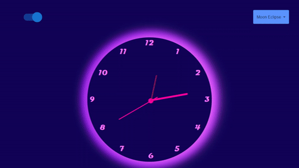

 _And our time is running out_ 
 _You can't push it underground_ 
 _You can't stop it screaming out_ 
 _How did it come to this?_ 
 _ Muse_ 

# Interactive Clock

## Description
The "Interactive Clock" project is an interactive virtual clock that allows you to track time in styles such as "Solar Eclipse," "Lunar Eclipse," and "Full Moon." It also includes an option to switch to regular digital clocks.

In digital clock mode, you can select the time for cities such as New York, London, Tokyo, and track the time in your time zone. The selected time is highlighted for clarity.

## Project Goal
The main goal of this educational project was to work with Data objects and create a complex clock face with a hand that always corresponds to the current time. The project also aimed to develop a unique cyberpunk style, including interesting fonts, stylization, and shadows.

## Tools and Technologies

    <a href="https://www.typescriptlang.org/" target="_blank" rel="noreferrer"> 
</a> 

The project was implemented using the following tools and technologies:

- **React**: The React library was used to create the project's interface and components.

- **Storybook**: The project integrated the Storybook tool for documenting and testing components, which allowed for more efficient work with the interface and interaction with individual components.

- **HTML and CSS**: HTML and CSS were used to create the unique clock face design and styles. Special attention was paid to details such as shadows and fonts.

- **Moment.js**: The Moment.js library was used to implement switching between different time zones and correct time handling.

- **Material-UI (MUI)**: The Material-UI library was integrated to create switches and interface elements for the project.

The project was designed so that the App component acted as a controller and delegated logic to other components. The Clock component was created to work with time and was then divided into two child components for ease of control and functionality extension.    

To install and run the project locally, follow these steps:

1. Clone the repository to your computer.
2. In the terminal, navigate to the project folder.
3. Install dependencies using the following command:
4. Start the project with the command: yarn start
5. The deployed project can be found at the following link: ...                                                                           
